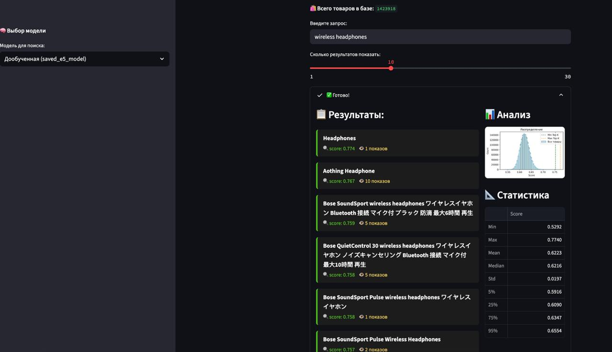
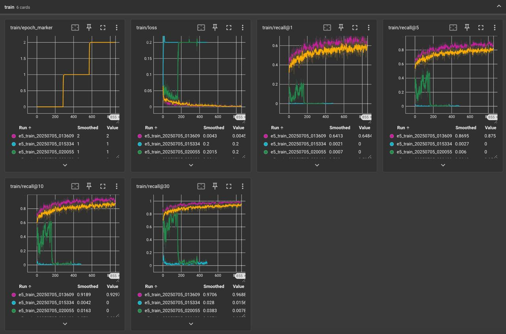
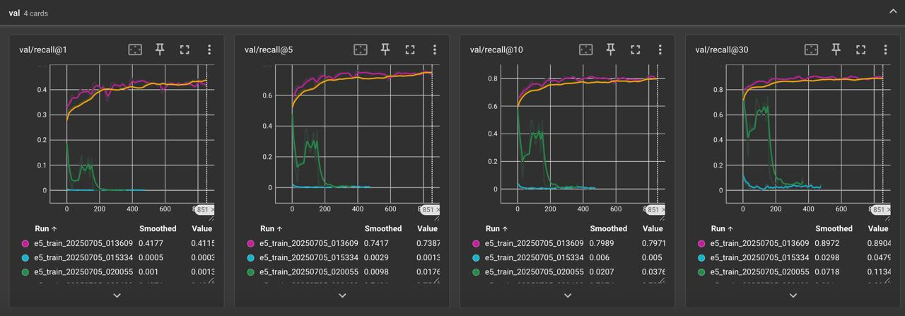
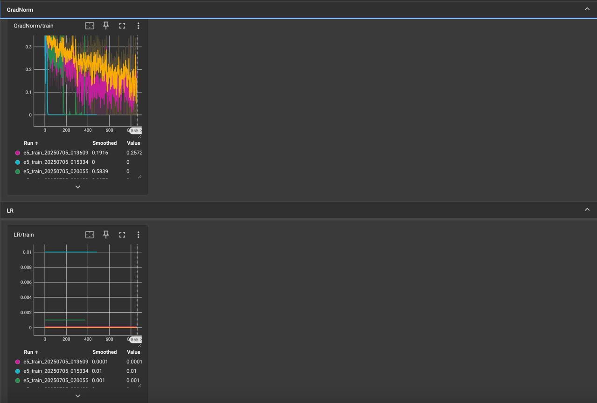
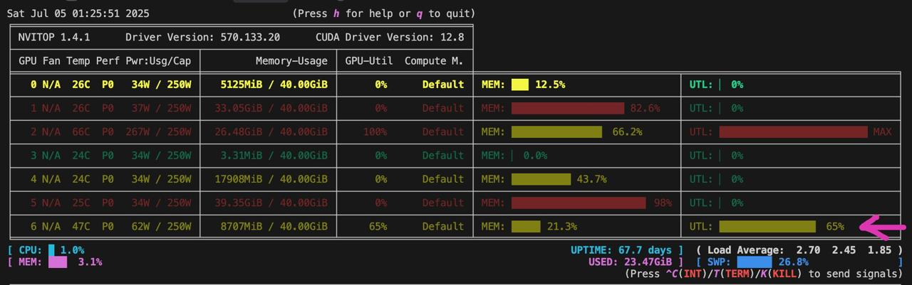
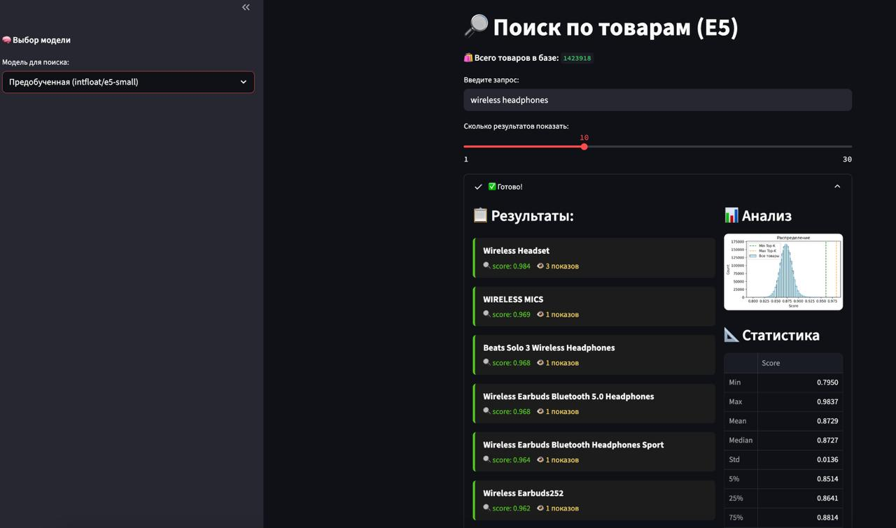

# Собираем MVP product search - дообучение E5 и веб-сервис для сравнения поисковых выдач

## Описание

Репозиторий содержит MVP-сервис для поиска по товарам с использованием дообученныз эмбеддингов E5. Решается задача поиска релевантных товаров по текстовому запросу пользователя. 

Используются датасеты с разметкой релевантности, модель E5 (предобученная и дообученная), расчет эмбеддингов и веб-интерфейс на Streamlit.



> Самое интересное (выводы и отсмотр изменений) в главе: **Сравнения поисковых выдач pretrain VS fine-tune E5** ! 


## Датасет

Используется датасет [Amazon ESCI](https://huggingface.co/datasets/tasksource/esci) с HuggingFace. Он содержит пары "запрос пользователя — товар" с меткой релевантности (`exact`, `substitute`, `irrelevant`).

**Пример формата:**
```json
{
  "query": "usb c charger for iphone",
  "product_title": "USB C Charger, 20W PD Wall Charger Block Compatible with iPhone 13 12 11",
  "esci_label": "exact"
}
```
---

## Структура проекта

```
├── app.py                    # Streamlit веб-приложение для поиска
├── EDA_plus_baseline.ipynb   # EDA и анализ данных
├── train_e5.ipynb            # Обучение и дообучение модели E5
├── calc_all_embed.ipynb      # Расчет эмбеддингов для товаров
├── product_titles.csv        # Названия товаров
├── product_embeddings.npy    # Эмбеддинги товаров (большой файл)
├── product_stats.csv         # Статистика просмотров товаров
├── saved_e5_model/           # Сохраненная модель
├── checkpoints/              # Чекпоинты обучения
├── runs/                     # Логи и результаты экспериментов
├── logs/                     # Логи (например, для TensorBoard)
├── images/                   # Картинки для README (создать вручную)
└── README.md                 # Этот файл
```

---

## Быстрый старт

### Установка зависимостей

```bash
pip install -r requirements.txt
# или вручную:
pip install streamlit torch transformers pandas numpy matplotlib seaborn tqdm datasets
```

### EDA и подготовка данных
- Открыть `EDA_plus_baseline.ipynb` для анализа и подготовки данных.

### Обучение модели
- Запустить `train_e5.ipynb` для дообучения модели E5.
- Чекпоинты сохраняются в папку `checkpoints/`.

### Расчет эмбеддингов товаров
- Запустить `calc_all_embed.ipynb` для получения эмбеддингов всех товаров.
- Результат сохраняется в `product_embeddings.npy`.

### Запуск веб-сервиса поиска

```bash
streamlit run app.py
```

---

## Внешние сервисы и мониторинг

### TensorBoard (если есть логи обучения)
```bash
tensorboard --logdir=logs/ --port=6006
```

На графиках видно, что происходило когда я экспериментировал с lr. При больших lr (`~lr=0.2-0.3`) модель разносило окончательно (и я останавливал эксперимент). 

На `lr=0.4-0.5` училась успешно (на бОльших эпохах модель тоже училась и графики не уходили на плату! ) 








### Мониторинг GPU
```bash
nvitop
# или
watch -n 1 nvidia-smi
```

> Я использую одну A100 (смотреть на 6 гпушку)




### Работа с фоновыми процессами через tmux
```bash
# Запустить новую сессию tmux с именем mysession
tmux new -s mysession
# Внутри tmux запускать сервисы (streamlit, tensorboard, nvitop и др.)
# Отсоединиться: Ctrl+b, затем d
# Вернуться: tmux attach -t mysession
# Список сессий: tmux ls
# Завершить сессию: exit
```

---

## Сравнения поисковых выдач pretrain VS fine-tune E5

pretrain E5


fine-tune E5


> Видно, что файнтюн дооучивается на пользовательскую разметку и учитывает популярность баннеров, а претраин учитывает только тексовую близость!

> Так же любопытно, что скоры у претраин максимально близки к максимому (к 1.0), а ft уже далеки от максимому.

> Любопытно - распределение скоров под запрос образуют нормальное распределение.

---

## .gitignore

В репозиторий не попадают большие и временные файлы:
```
product_embeddings.npy
small_product_embeddings.npy
product_stats.csv
product_titles.csv
runs/
saved_e5_model/
checkpoints/
logs/
```

---

## Направления для улучшения
- Вынести код из ноутбуков в отдельные модули
- Использовать PytorchLightning, ClearML, wandb
- Квантизация модели, ONNX, Faiss, батчевый инференс
- Не загружать весь датасет в память, использовать итераторы
- Улучшить структуру проекта и сигнатуры функций

---

## Полезные ссылки
- [HuggingFace — product search datasets](https://huggingface.co/datasets?search=product+search)
- [Okapi BM25 (wiki)](https://en.wikipedia.org/wiki/Okapi_BM25)
- [Multilingual E5 Text Embeddings: A Technical Report](https://arxiv.org/pdf/2402.05672)
- [Streamlit](https://streamlit.io/)
- [Pytorch Lightning](https://www.pytorchlightning.ai/)
- [Faiss](https://github.com/facebookresearch/faiss)
- [ClearML](https://clear.ml/)

